# PHOTON Team Design Notebook

**Project:** Ethernet-to-Fiber Media Converter with Proactive Fault Detection and Redundant Failover

**Course:** Georgia Tech ECE 4015 Capstone, Fall 2026

**Faculty Advisor:** Dr. Jane Gu

**Coverage:** September 2–21, 2026

**Last updated:** September 21, 2026

## Team and workstream ownership

*Table 1. Proposal-defined team ownership and primary technical workstreams.*

| Team member | Primary workstream | Proposal-defined responsibilities |
|---|---|---|
| Madhawi Alharbi | Hardware design | Part selection, schematic design, PCB layout, hardware bring-up, and hardware/firmware testing |
| Ethan Su | Ethernet-switch hardware | LAN96455F ownership, sourcing, schematic entry, PCB layout, bring-up, and hardware/firmware co-validation |
| Auska Wang | Firmware architecture | Firmware design/management, Ethernet-switch configuration and bring-up, and external-flash management |
| Yichi Zhang | STM32 and monitoring firmware | STM32 development, SFP monitoring, health/failover logic, firmware/hardware co-design, and system integration |

System integration and bring-up are collaborative team activities.

## Notebook conventions

- Entries are chronological team milestones rather than four isolated personal logs.
- **Completed** means an artifact or recorded review supports the statement. **In progress** and **planned** identify unfinished implementation or validation.
- The proposal and slides define group scope and roles; project_context supplies the technical chronology and current design state.
- Datasheets and native design files remain authoritative. Screenshots document progress but do not prove saved connectivity, ERC success, or released hardware.

## Figure and table register

| ID | Description | Related milestone |
|---|---|---|
| Figure 1 | Two-board system architecture | September 2 and 12 |
| Figure 2 | Single-board functional architecture | September 12 |
| Figure 3 | Preliminary per-board power distribution | September 14 |
| Figures 4–6 | LAN96455F and SFP host-component library evidence | September 10 and 11 |
| Figures 7–8 | RGMII strap and switch EEPROM development | September 16 |
| Figure 9 | Switchable-strap voltage-divider implementation | September 17 |
| Figure 10 | LAN96455F configuration-sheet checkpoint | September 18 |
| Figures 11–12 | Updated GPIO/strap and RGMII configuration work | September 20 |
| Table 1 | Team ownership | Project-wide |
| Table 2 | Current project snapshot | September 21 |
| Table 3 | Reference-document matrix | Project-wide |

---

## Wednesday, September 2, 2026 — Architecture definition

**Objective:** Convert the initial media-converter concept into a demonstrable system architecture.

### Team highlights

| Team member | Highlight |
|---|---|
| Madhawi | Established the hardware workstream around two identical boards, copper Ethernet, redundant optics, and board-level power. |
| Ethan | Developed and iterated the initial block diagrams linking the STM32, LAN96455F, RJ45, SFPs, fiber paths, and USB-C power. |
| Auska | Defined the need for switch configuration and a coordinated control path separate from hardware forwarding. |
| Yichi | Defined the STM32 need for local SFP monitoring, health evaluation, and board-to-board failover coordination. |

### Technical outcomes

- Selected two identical boards, each connected to a laptop through 1000BASE-T.
- Defined independent primary and backup full-duplex 1000BASE-SX paths.
- Kept laptop traffic in the LAN96455F data plane; STM32 devices are management endpoints, not software bridges.
- Defined in-band management as Ethernet frames carried alongside user traffic.
- Assigned Board A as controller/master and Board B as agent through firmware configuration.

**Status/evidence:** Completed architecture milestone. Initial Draw.io artifacts are recorded as sbd/photon.drawio and sbd/photon_copy.drawio.

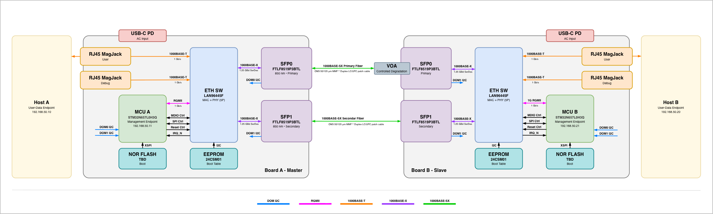

*Figure 1. Refined system-level architecture showing two identical converter boards, two laptop endpoints, primary and backup full-duplex fiber paths, and in-band management. This later export documents the architecture initiated on September 2.*

**Next actions:** Refine proposal graphics; assign workstreams; freeze interfaces, switch modes, power, and parts.

---

## Wednesday, September 9, 2026 — Scope, schedule, and interface planning

**Objective:** Establish the project target, implementation path, and December 8 expo timeline.

### Team highlights

| Team member | Highlight |
|---|---|
| Madhawi | Scoped hardware work around selection, schematic capture, PCB layout, fabrication, and bring-up. |
| Ethan | Prepared project-scope material and the LAN96455F pin-mapping workbook for the multipart Altium symbol. |
| Auska | Owned firmware architecture and Ethernet-switch configuration planning. |
| Yichi | Owned STM32, SFP telemetry, health/failover, and integration planning. |

### Technical outcomes

- Targeted a 1 Gb/s laptop-to-laptop connection over redundant 1000BASE-SX paths.
- Planned the sequence: freeze interfaces/parts; complete schematic/PCB; bring up power, MCU, switch, copper, and SFP; then implement telemetry and failover.
- Planned September architecture/schematic work, PCB and bring-up through mid-November, and integration through December 8.
- Began formal switch-symbol preparation using a pin-mapping workbook.

**Status/evidence:** Completed planning milestone. See team-docs/intelligent-ethernet-fiber-project-scope-presentation.pptx and eth_SW/LAN96455F-I-8NW_Altium_Pin_Mapping.xlsx.

**Next actions:** Verify the LAN96455F library; select SFP host parts; translate interfaces into schematic sheets and firmware modules.

---

## Thursday, September 10, 2026 — LAN96455F footprint and SFP selection

**Objective:** Establish reliable library foundations for the Ethernet switch and optical interface.

### Team highlights

| Team member | Highlight |
|---|---|
| Madhawi | Focused the hardware workstream on manufacturable exposed-pad geometry and later layout constraints. |
| Ethan | Built/reviewed the 156-pin LAN96455F footprint and selected the Coherent/Finisar FTLF8519P3BNL. |
| Auska | Identified the dependency on SPI switch control and switch bring-up before failover logic. |
| Yichi | Identified the dependency on SFP I²C diagnostics and status/control signals. |

### Technical outcomes

- Corrected switch pad numbering and pin-1 marking.
- Added segmented exposed-pad paste, a 6 × 6 thermal-via array, courtyard, assembly, and body documentation.
- Selected a 3.3 V, 850 nm, 1000BASE-SX, duplex-LC SFP with digital diagnostics.
- Confirmed the SFP module, PCB receptacle, and metal cage are separate sourced items.

**Status/evidence:** Library work completed and visually reviewed; final stackup/fabrication and mapping checks remain.

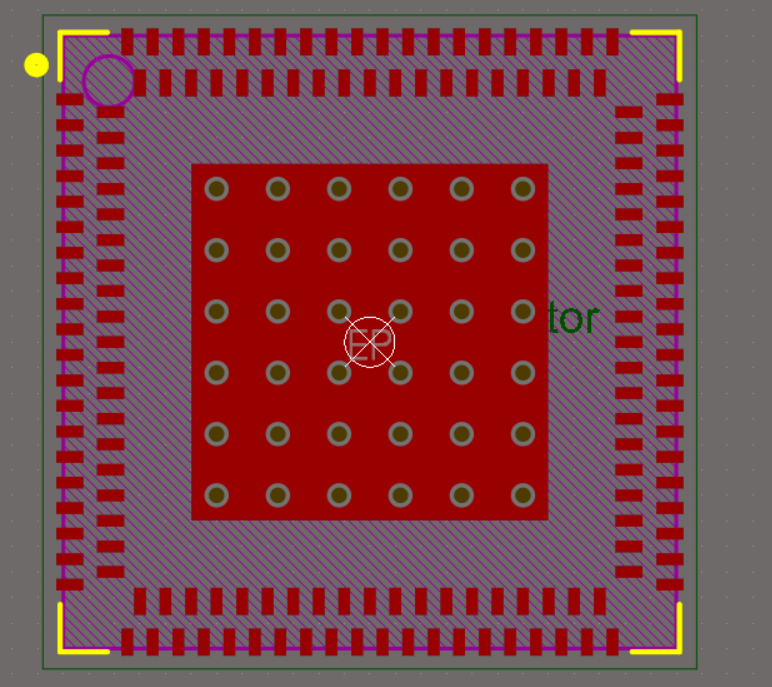

*Figure 4. Altium top view of the LAN96455F footprint. The image documents perimeter pads, the exposed-pad paste pattern, thermal-via array, pin-1 marking, and component outlines; it is review evidence rather than fabrication release approval.*

**Next actions:** Source cage/receptacle; verify footprint rules; define MCU-to-switch and MCU-to-SFP circuits.

---

## Friday, September 11, 2026 — SFP receptacle and cage libraries

**Objective:** Complete the removable optical-module host interface at the library level.

### Team highlights

| Team member | Highlight |
|---|---|
| Madhawi | Emphasized board-edge placement, cage clearance, keepouts, and enclosure constraints. |
| Ethan | Implemented/reviewed Molex 74441-0010 and 74737-0010 as separate overlapping Altium components. |
| Auska | Preserved requirements for independent path control and status reporting. |
| Yichi | Preserved requirements for reading both modules and reporting channel health. |

### Technical outcomes

- Froze 74441-0010 as the receptacle and 74737-0010 as the separate cage.
- Used a common manufacturer datum so both components align at the same PCB coordinates.
- Included contacts, mechanical holes/posts, 3D models, and clearance documentation.
- Confirmed each duplex LC optical path uses separate transmit and receive fibers.

**Status/evidence:** Library components completed and visually reviewed; front-panel and assembled-PCB clearance remain open.

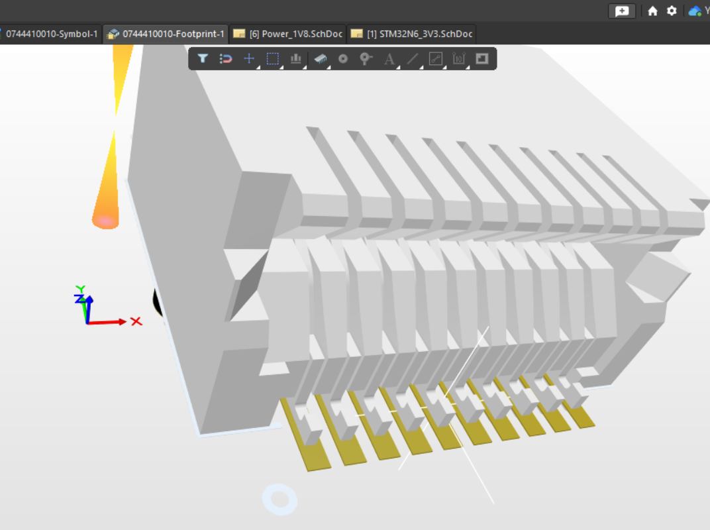

*Figure 5. Molex 74441-0010 SFP receptacle aligned with its PCB footprint and manufacturer 3D model.*

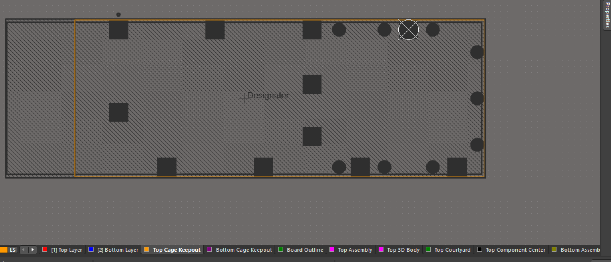

*Figure 6. Separate cage footprint and mechanical envelope used at the same component datum as the receptacle.*

**Next actions:** Add both SFP channels to the STM32 schematic; finalize SFP power, high-speed coupling, telemetry, and sidebands.

---

## Saturday, September 12, 2026 — Proposal, QFD, and design communication

**Objective:** Consolidate need, requirements, design, demonstration, and schedule into proposal artifacts.

### Team highlights

| Team member | Highlight |
|---|---|
| Madhawi | Contributed proposal Sections 5–11. |
| Ethan | Contributed the executive summary, nomenclature, Sections 1–3, and system block diagrams. |
| Auska | Contributed Section 4 and aligned the approach with firmware/system behavior. |
| Yichi | Prepared the proposal slides and firmware/monitoring direction. |

### Technical outcomes

- Framed the need around AI/data-center bandwidth, copper loss/heat, fiber adoption, and proactive maintenance.
- Defined the novelty as detecting degradation and coordinating pre-failure transfer—not redundancy alone.
- Set proposal targets: 1 GbE, at least 900 Mb/s TCP, at least one complete local telemetry update per second, and a preliminary sub-100 ms interruption stretch goal.
- Defined an attenuation test with continuous traffic and recorded optical power, path state, packet loss, throughput, interruption, and recovery.
- Updated the QFD and two-board, single-board, and preliminary power diagrams.

**Status/evidence:** Completed proposal-development milestone. See the proposal, slides, QFD, and exported diagrams.

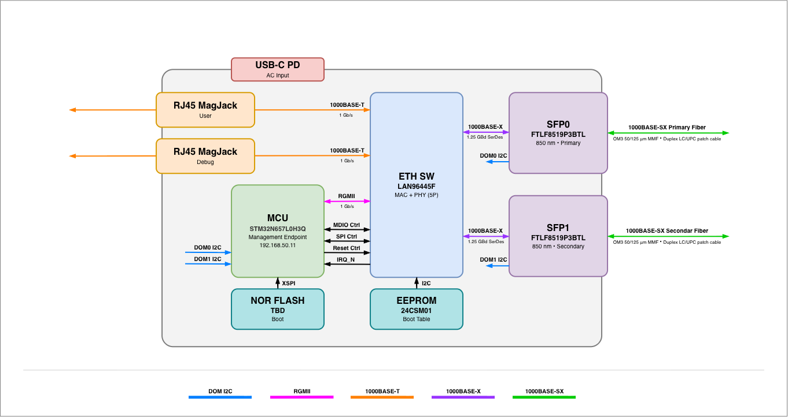

*Figure 2. Single-board architecture used to partition Ethernet switching, STM32 management, optical telemetry, storage, power, and external interfaces.*

**Next actions:** Convert the architecture into component-level design; verify all performance targets experimentally after bring-up.

---

## Monday, September 14, 2026 — Reference-design review and power architecture

**Objective:** Turn the concept into a defensible switch-support and board-power plan.

### Team highlights

| Team member | Highlight |
|---|---|
| Madhawi | Advanced the regulator, load-switch, thermal-footprint, and board-power workstream. |
| Ethan | Reviewed the EDS2 reference, compared modes, developed the switch current budget, and sourced power parts. |
| Auska | Defined the relationship between boot/management mode and firmware switch control. |
| Yichi | Preserved STM32 boot, RGMII, telemetry, and sequencing dependencies. |

### Technical outcomes

- Adopted first-stage 3.3 V and 1.8 V bucks; the 1.15 V switch-core buck is fed from switched 3.3 V.
- Calculated about 1.188 A for the Ethernet protected branch, including the 1.15 V converter input at assumed 80% efficiency.
- Selected MIC22405YML-TR as the working 1.15 V buck and TPS22950CDDCR as the load-switch candidate.
- Built/reviewed Altium library components for both parts.
- Treated EDS2 as an electrical reference—not proof that its boot or Linux/DSA architecture should be copied.

**Status/evidence:** Power topology and working components defined; calculations, sequencing, and schematic approval remain open.

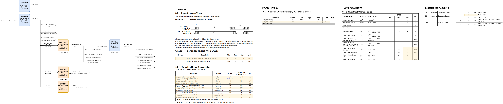

*Figure 3. Preliminary power-distribution view. Current calculations and later decisions in POWER_TREE.md supersede any conflicting value or connection shown in this diagram.*

**Next actions:** Complete switch control, reset, clock, high-speed, and power-support sheets; freeze 3.3 V and 1.8 V bucks.

---

## Tuesday, September 15, 2026 — Cross-device workflow and control planning

**Objective:** Create a durable handoff between research, Windows/Altium implementation, and team documentation.

### Team highlights

| Team member | Highlight |
|---|---|
| Madhawi | Gained a shared hardware record for parts, schematic status, decisions, and evidence. |
| Ethan | Organized project_context and began the LAN96455F control/strap plan. |
| Auska | Gained a firmware handoff covering switch initialization and ownership questions. |
| Yichi | Gained a handoff covering RGMII, SFP telemetry, management, and integration dependencies. |

### Technical outcomes

- Established project_context as the synchronized source for design summaries, decisions, and history.
- Standardized datasheet evidence and proposed-versus-frozen decision labels.
- Organized switch support into straps/GPIO, EEPROM, reset, clock, RGMII/SPI, SerDes/SFP, and power passes.

**Status/evidence:** Documentation workflow active; no electrical design is released solely because it appears in notes.

**Next actions:** Resolve RGMII strap coexistence, SPI mapping, boot strategy, and EEPROM recovery.

---

## Wednesday, September 16, 2026 — Boot, EEPROM, RGMII, and management

**Objective:** Resolve high-risk LAN96455F configuration interfaces before completing capture.

### Team highlights

| Team member | Highlight |
|---|---|
| Madhawi | Incorporated strap loading, reset-time behavior, domains, and EEPROM programming constraints. |
| Ethan | Reviewed shared RGMII straps, corrected SPI mapping, built configuration tables, and iterated the EEPROM circuit. |
| Auska | Defined STM32/SPI control as the intended default, with ROM/EEPROM retained as selectable recovery pending validation. |
| Yichi | Defined the need for STM32 RGMII receive pins to remain high impedance during switch strap sampling. |

### Technical outcomes

- Proposed default BOOT_MODE=000 and MGMT_MODE=11, with STM32 management through SPI; custom initialization remains to be proven.
- Preserved selectable BOOT_MODE=100 EEPROM recovery; it is not automatic or fully validated.
- Confirmed RGMII0 on GPIO16–27; GPIO22–27 retain strap pulls during runtime.
- Corrected SPI client mapping to GPIO4–7.
- Adopted 24CSM01-I/SN, superseding the earlier 24AA014H concept.
- Revised the displayed EEPROM circuit to switched VDD_IO_A, 2.5 kΩ I²C pull-ups, and DNP address options.

**Status/evidence:** Configuration sheet substantially developed through reviewed screenshots; native connectivity, ERC, EEPROM contents, and complete boot behavior remain open.

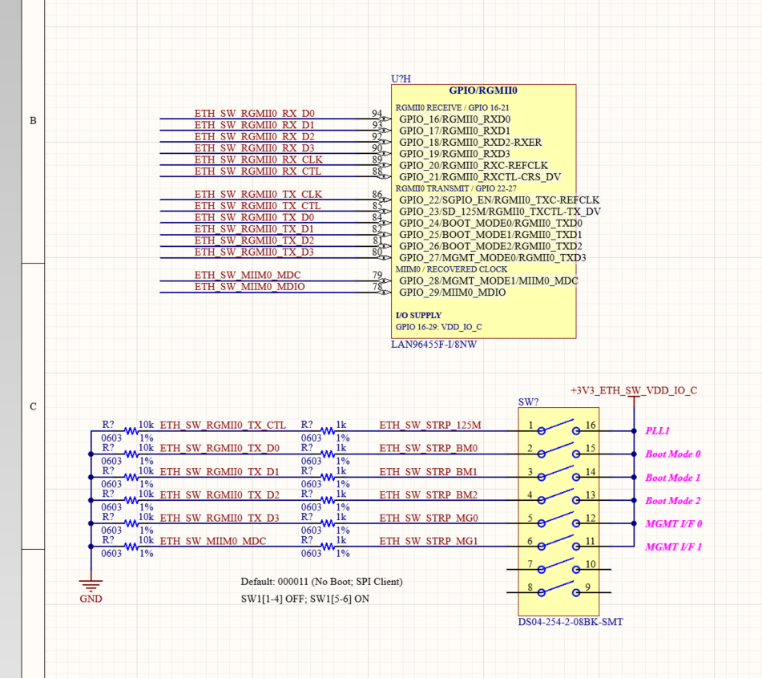

*Figure 7. Draft RGMII0 interface showing reset-sampled strap networks that remain electrically connected to runtime transmit signals.*

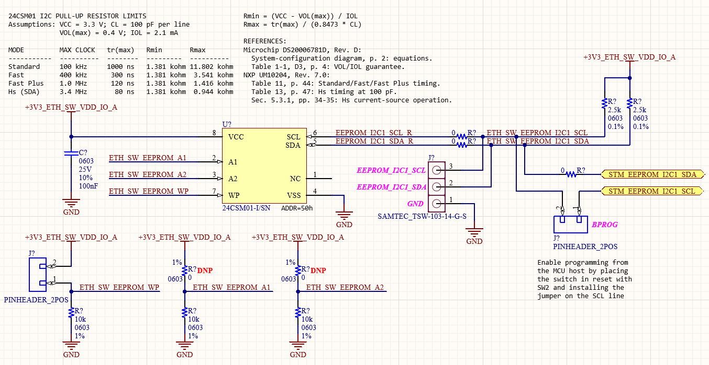

*Figure 8. Revised switch-configuration EEPROM draft on the switched VDD_IO_A domain with I²C pull-ups and optional address populations. Native connectivity and programming sequence still require validation.*

**Next actions:** Review remaining straps and margins; prove initialization/ownership; inspect native variants and connectivity.

---

## Thursday, September 17, 2026 — Strap margins and copper indicators

**Objective:** Refine configuration straps and the optional copper-port indicator strategy.

### Team highlights

| Team member | Highlight |
|---|---|
| Madhawi | Focused on electrically valid, assembly-readable straps compatible with runtime functions. |
| Ethan | Checked 1 kΩ/10 kΩ strap-divider margins and mapped copper LED candidates and port roles. |
| Auska | Preserved runtime pin control while avoiding SPI and SFP-sideband conflicts. |
| Yichi | Preserved status reporting without consuming pins required for SFP monitoring. |

### Technical outcomes

- Verified usable logic margin for the reviewed switchable strap network.
- Proposed one physical status LED per populated copper port.
- Clarified the planned mix: laptop CuPHY0/DEV0, optional debug CuPHY1/DEV1, optical DEV5/DEV6, and STM32 RGMII0 DEV7.
- Kept LED mapping and optional debug-RJ45 population open.

**Status/evidence:** Electrical review and proposed mapping complete; final population/routing are not frozen.

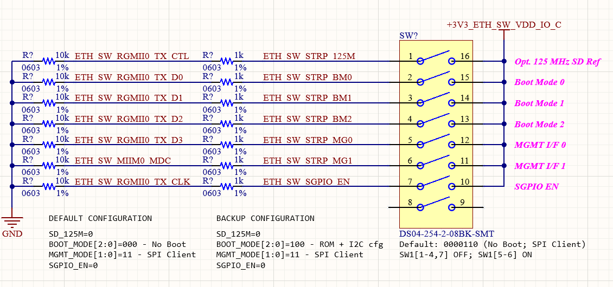

*Figure 9. Reviewed 1 kΩ/10 kΩ switchable strap network. The image records the working implementation and voltage-margin review, not a final population release.*

**Next actions:** Compare GPIO modes; select 1000BASE-T jack/magnetics; freeze a per-pin boot/runtime table.

---

## Friday, September 18, 2026 — GPIO modes and control-sheet review

**Objective:** Reconcile pin multiplexing with copper, optical, SPI, and EEPROM interfaces.

### Team highlights

| Team member | Highlight |
|---|---|
| Madhawi | Screened RJ45/magnetics implications and the optional debug-copper interface. |
| Ethan | Reviewed RJ45 candidates, straps, GPIO Modes A/D, EEPROM addressing, and the ETH SW Config Sheet. |
| Auska | Evaluated boot0/boot4 ownership and Mode D conflicts with SPI client pins. |
| Yichi | Evaluated consequences for STM32-controlled telemetry, LOS, TX disable, and failover. |

### Technical outcomes

- Rejected visible RJ45 candidates as unsuitable or unverified for required 1000BASE-T; selection remains open.
- Verified proposed strap directions while retaining final populations as provisional.
- Found Mode D fits the interface count, but its default GPIO4–7 SFP sidebands conflict with SPI.
- Clarified boot0 STM32 initialization versus boot4 ROM/EEPROM behavior and link-event ownership.
- Archived the in-progress configuration sheet with straps, RGMII, SPI, EEPROM/programming, and GPIO groups.

**Status/evidence:** Major control architecture reviewed but not released; native connectivity, designators, variants, and ERC remain.

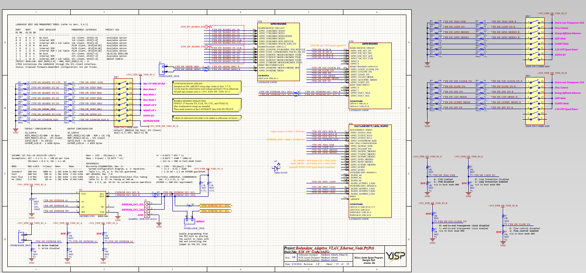

*Figure 10. Full-sheet checkpoint containing boot and management tables, selectable straps, RGMII/SPI labels, EEPROM/programming circuitry, and GPIO symbol groups. Off-sheet alternatives and unresolved assignments remained in progress.*

**Next actions:** Reconstruct GPIO allocation; resolve custom SFP sidebands; select gigabit RJ45/magnetics.

---

## Saturday, September 19, 2026 — Manufacturer support outreach

**Objective:** Reduce integration risk through Microchip applications-engineering review.

### Team highlights

| Team member | Highlight |
|---|---|
| Madhawi | Prepared to supply power, clock, reset, and schematic questions. |
| Ethan | Contacted a Microchip field applications engineer for LAN9645xF support. |
| Auska | Identified questions about non-Linux initialization, internal-controller behavior, and control. |
| Yichi | Identified RGMII, SFP bus/sideband, and coordinated-failover questions. |

### Technical outcomes

- Established a route for manufacturer feedback on the STM32-hosted architecture.
- Prioritized boot, management ownership, RGMII MAC-to-MAC, SFP access, and path-control questions.

**Status/evidence:** Outreach is user-reported; a formal response had not been received.

**Next actions:** Consolidate questions and GPIO mapping, send the review package, and incorporate authoritative feedback.

---

## Sunday, September 20, 2026 — GPIO allocation and review package

**Objective:** Turn pin-mux questions into a reviewable schematic/control package.

### Team highlights

| Team member | Highlight |
|---|---|
| Madhawi | Reviewed strap domains, inter-sheet interfaces, programming circuitry, and unresolved reset/RJ45 items. |
| Ethan | Reconstructed the GPIO table, reviewed configuration screenshots, improved labels/ports, and drafted the FAE email. |
| Auska | Defined questions for SPI initialization, ROM/table ownership, link events, and runtime GPIO configuration. |
| Yichi | Defined RGMII, SFP I²C, LOS, telemetry ownership, and failover-control questions. |

### Technical outcomes

- Produced a GPIO0–50 table with ALT functions, proposed connections, and unresolved entries.
- Proposed SD_MODE=11 for two SFPs and XMII_MODE0=0 for STM32 RGMII0, subject to full initialization validation.
- Distinguished runtime SFP signal detect/LOS from reset-sampled SerDes-mode straps.
- Added horizontal switch tables, corrected labels, and RGMII/SPI/EEPROM/LED inter-sheet ports.
- Drafted a manufacturer review email covering topology, modes, RGMII, SFPs, GPIO mapping, and failover control.

**Status/evidence:** Configuration GPIO circuitry is substantially captured and visually reviewed. The email remained a draft; native netlist/ERC and final ownership remain open.

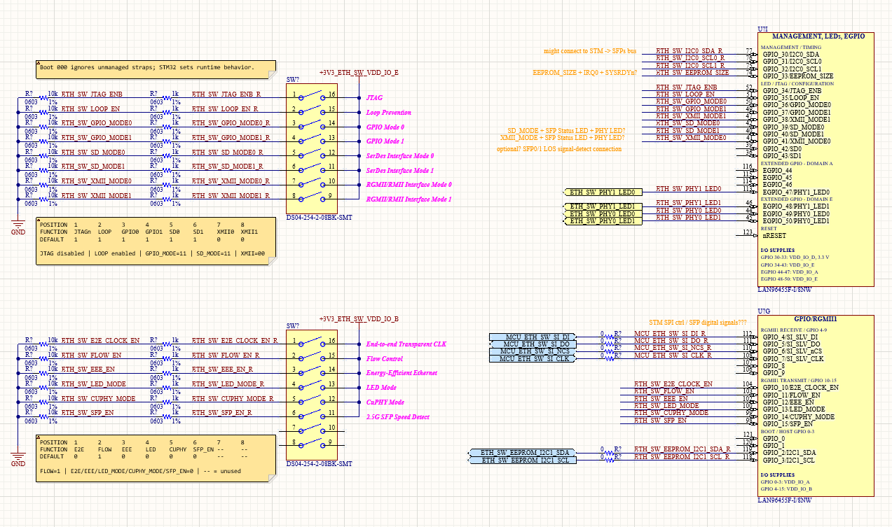

*Figure 11. Updated GPIO and strap groups with horizontal state tables and inter-sheet ports. Orange notes identify unresolved runtime assignments.*

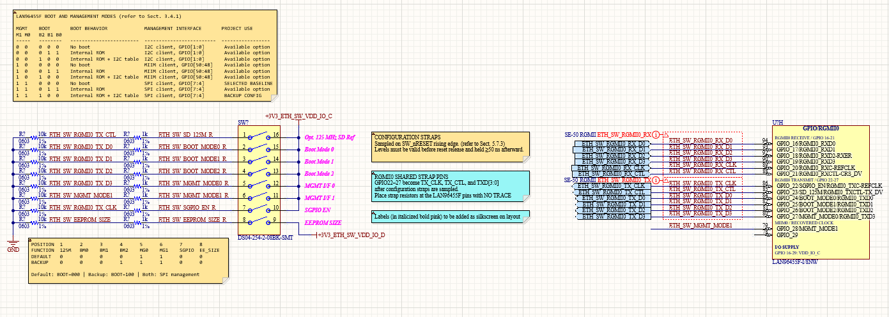

*Figure 12. Updated main boot/management straps and RGMII interface ports after label and switch-table cleanup.*

### Next actions

- [ ] Complete the reset-supervisor circuit.
- [ ] Source and design the 25 MHz reference clock.
- [ ] Complete SerDes/HSIO and switch bulk/decoupling/filter networks.
- [ ] Obtain manufacturer feedback before freezing high-risk choices.

---

## Monday, September 21, 2026 — Architecture review and status checkpoint

**Objective:** Review firmware architecture, record hardware completion, and align the next sprint.

### Team highlights

| Team member | Highlight |
|---|---|
| Madhawi | Reviewed hardware status and retained focus on STM32/SFP completion, PCB development, and bring-up. |
| Ethan | Reviewed switch status; configuration GPIOs are ready to proceed to reset, clock, HSIO, and power support. |
| Auska | Co-reviewed firmware architecture and defined the switch configuration/management skeleton work. |
| Yichi | Co-reviewed firmware architecture and defined the STM32, SFP-monitoring, health, and failover skeleton work. |

### Technical outcomes

- Reviewed the firmware architecture system block diagram and accepted it as a good implementation basis.
- Set the next firmware step: create a skeleton framework for all STM32 and Ethernet-switch code files.
- STM32 schematic is mostly complete; both SFP interfaces remain to be completed.
- Ethernet-switch schematic is approximately half complete. Configuration GPIOs are done; major remaining blocks are reset, 25 MHz clock, HSIO/SerDes, and power bulk/decoupling/filtering.
- Identified MIC2774N-29YM5-TR as a reference-equivalent reset candidate; divider, timing, loading, and final schematic remain open.

**Status/evidence:** Architecture review completed. Code skeletons and remaining schematic blocks are next actions, not completed implementation.

### Next actions

#### Firmware — Auska and Yichi

- [ ] Create the common build/source-tree skeleton for STM32 application and LAN96455F management code.
- [ ] Add placeholder modules for board support, SPI, networking/RGMII, SFP I²C/DOM, GPIO/status, telemetry, event logging, health assessment, arbitration, and coordinated failover.
- [ ] Define interfaces, ownership, configuration data, and test seams before hardware-specific implementation.

#### Hardware — Ethan and Madhawi

- [ ] Complete both STM32-to-SFP channels: power/control, I²C, status, and high-speed connections.
- [ ] Complete and review the LAN96455F reset circuit.
- [ ] Source and validate the 25 MHz crystal or oscillator and support network.
- [ ] Complete LAN96455F HSIO/SerDes connections to both SFP receptacles.
- [ ] Complete switch bulk capacitance, decoupling, ferrite/filtering, sequencing, and test points.
- [ ] Select the required 1000BASE-T RJ45/magnetics and resolve optional debug copper.

#### Team integration

- [ ] Freeze the MCU/switch/SFP interface contract so schematic net names and firmware modules match.
- [ ] Review the completed code skeleton and remaining schematic sheets together before detailed implementation or layout.
- [ ] Incorporate Microchip feedback when available.

---

## Current project snapshot — September 21, 2026

*Table 2. Consolidated project status at the September 21 architecture review.*

| Workstream | Status | Immediate gate |
|---|---|---|
| Requirements and architecture | Complete | Maintain interface consistency |
| Component/interface selection | Mostly complete | Freeze MCU ordering code, main bucks, clock, and RJ45/magnetics |
| Firmware architecture | Reviewed and accepted | Create code skeleton and module interfaces |
| STM32 schematic | Mostly complete | Complete both SFP channels and review |
| LAN96455F schematic | Approximately 50% | Reset, 25 MHz clock, HSIO, and power support |
| PCB layout | Not started | Complete/review schematics |
| Firmware implementation | Early development | Establish buildable skeleton and low-level drivers |
| Bring-up and validation | Not started | Await fabricated hardware |

## Near-term review checklist

- [ ] Every schematic interface has a firmware owner and matching module.
- [ ] Every reset-sampled switch pin has a documented strap, domain, runtime role, and population.
- [ ] Power budgets include downstream conversion, inrush, tolerance, and margin.
- [ ] SFP DOM, LOS, TX fault, presence, and TX disable ownership are unambiguous.
- [ ] Path control cannot produce mismatched active paths between boards.
- [ ] Notes/screenshots are reconciled against native connectivity and ERC before release.
- [ ] Throughput and failover targets remain labeled unverified until bench testing.

## Reference-document matrix

*Table 3. Team artifacts, manufacturer references, and shared technical-context documents used by this notebook.*

| Reference | Use in this project | Status |
|---|---|---|
| [ECE Proposal Report](<ECE Proposal Report.docx>) | Scope, requirements, demonstration, schedule, roles, and proposal contributions | Team source |
| [ECE Proposal Report Slides](<ECE Proposal Report Slides.pptx>) | Group architecture, firmware layers, targets, risks, schedule, and responsibilities | Team source |
| [Initial project-scope presentation](intelligent-ethernet-fiber-project-scope-presentation.pptx) | Early target, architecture, implementation plan, and expo timeline | Team source |
| [LAN9645xF data sheet](../../eth_SW/docs/LAN9645xF-Data-Sheet-DS00006065.pdf) | Switch pins, domains, ports, GPIO muxing, straps, boot modes, electrical requirements, and timing | Primary manufacturer reference |
| [LAN96459F EDS2 user guide](../../eth_SW/docs/LAN96459F_EDS2.pdf) | Reference schematic for reset, clock, EEPROM, straps, RGMII, power, and SFP-related wiring | Reference design; not automatically project-mandatory |
| [LAN96455 reference tables](../../eth_SW/docs/LAN96455_Project_Reference_Tables.xlsx) | Project GPIO and configuration working tables | Project working document |
| [FTLF8519P3xyL SFP data sheet](../../sfp/FTLF8519P3xyL_RevC1_8-14-14.pdf) | Optical/electrical ratings, host interface, diagnostics, and module timing | Primary manufacturer reference |
| [Molex 74441-0010 receptacle drawing](../../sfp/sfp_receptacle/744410010_sd.pdf) | Receptacle footprint and mechanical datum | Primary manufacturer reference |
| [Molex 74737-0010 cage drawing](../../sfp/sfp_cage/747370010_sd.pdf) | Cage footprint, posts, clearances, and mechanical envelope | Primary manufacturer reference |
| [MIC22405 data sheet](../../power_ic/mic22405.pdf) | 1.15 V buck design and layout | Primary manufacturer reference |
| [TPS22950 data sheet](../../power_ic/tps22950.pdf) | Ethernet-switch and SFP load-switch design | Primary manufacturer reference |
| [Project overview](../../project_context/PROJECT_OVERVIEW.md) | Current topology and team split | Shared technical context |
| [System architecture](../../project_context/ARCHITECTURE.md) | Interfaces, data/control paths, and board roles | Shared technical context |
| [Component selections](../../project_context/COMPONENT_SELECTIONS.md) | Current part numbers and selection status | Shared technical context |
| [Power tree](../../project_context/POWER_TREE.md) | Rail topology, maximum-current basis, and sequencing notes | Shared technical context |
| [Design decisions](../../project_context/DESIGN_DECISIONS.md) | Frozen/proposed decisions and open items | Shared technical context |
| [LAN96455 control notes](../../project_context/LAN96455_CONTROL.md) | Boot, management, EEPROM, straps, reset, and GPIO analysis | Shared technical context |
| [Personal engineering log](../../project_context/PERSONAL_ENGINEERING_LOG.md) | Detailed chronological evidence supporting this team summary | Shared technical context |
